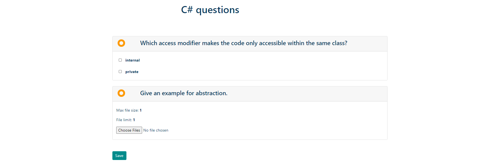

# Survello

Survello is a web application for creating and sharing forms, helping users and businesses gather anonymous information and analyze the received results. The main functionalities of the application are: dynamically adding/editing or removing questions within a form, sharing forms via email, and uploading files to Azure Blob.

# Technologies
- ASP.NET Core
- ASP.NET Identity
- Entity Framework Core
- MS SQL Server
- AJAX
- Bootstrap
- JavaScript / jQuery
- HTML 5
- CSS 3
- Azure

# Areas
- Public - accessible without authentication
- Private - available after registration
- Administrative - available for admins only

# Public part
Users are only allowed to visit the home page and register or log in.
If an email with an invitation to fill a form is sent, the link will lead the user to a page where he can anonymously fill and send his answers which can be reviewed only by the user who created the form.

# Private part
Already registered users have acess to the full functionality of the application - creating, editing, removing and sharing forms, reviewing all answers.
## Create form

This functionality includes dynamically adding or removing three types of questions:
- **Text question** - simple question - answer option.
- This question can be marked as required to be answered and marked as long answer which allows the user to write longer answer. 
- This option makes the field for answer appear as text area instead of input.

- **Options question** - question with multiple choice options. 
- The user can add or remove as many options as he wants. The question can be marked as required or as long answer which changes the appearance of the options - the options appear with checkboxes instead of radio buttons.
- The options of the question MUST be at least two.

- **Document question** - the answer to this question is a file which can be attached and later reviewed.
- Azure Blob integration for storing the files.
- The user can choose the limit of files (max 10) and the maximum size of the files (max 1GB). This question also gives the option to be marked as required.

## Validations 
Front-end validations included with jQuery and additionally back-end validations are added using the built in middleware of ASP.NET.

## Edit form
After creating the form the user is given the option to edit already existing form. When editing a form a new version of the form is created with the purpose of storing history of the answers.
When editing a form the user can edit the already existing questions, as well as adding new ones.

## List forms
The user has can review all his forms and order them by title, date of creation and number of filled forms. In this view are included theoptions for sharing and removing form.

## Share form
Integration with Gmail

## Delete form

## Details of form
In this view the user can see the details of the form he has created. All options are desabled. A list of answers is included. When clicked on it, the user is led to another view with the filled form.

## Answered form
On this view the user can see every answer to the form he has created. 

